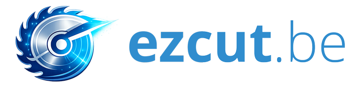

<div align="center">
  

  # ezcut.be
  
  **L'optimisation de découpe de panneaux 2D, simplifiée.**

  [](https://reactjs.org/)
  [](https://www.typescriptlang.org/)
  [](https://tailwindcss.com/)
  [](https://vitejs.dev/)

  [Accéder à l'application](https://ezcut.be) • [Support](mailto:anym@hotmail.fr)
</div>

---

## 🚀 À propos

**ezcut.be** est un outil web ultra-performant conçu pour les menuisiers, artisans, et bricoleurs. Il permet d'optimiser le placement de pièces rectangulaires sur des panneaux bruts afin de minimiser les chutes et maximiser l'efficacité de la matière première.

Que vous travailliez le bois, l'aluminium, ou le verre, **ezcut.be** calcule pour vous le meilleur agencement possible en quelques millisecondes.

## ✨ Fonctionnalités clés

- 🧩 **Algorithme Bin Packing** : Optimisation avancée pour un taux d'utilisation maximal.
- ♻️ **Gestion du Stock & Chutes** : Réutilisez vos restes de projets précédents en priorité.
- ⚙️ **Paramètres de Coupe** : Prise en compte de l'épaisseur de la lame (Kerf) et des marges de sécurité.
- 🔄 **Rotation Intelligente** : Autorisez ou bloquez la rotation par pièce pour respecter le fil du bois.
- 📊 **Tableau de Bord KPI** : Visualisation instantanée de l'efficacité, de la surface utile et des pertes.
- 📥 **Import / Export** : Sauvegardez vos configurations ou partagez-les via JSON.
- 🖼️ **Export PNG** : Téléchargez vos plans de découpe haute résolution.
- 🌓 **Mode Sombre / Clair** : Interface premium conçue pour le confort visuel.

## 🛠️ Stack Technique

- **Frontend** : React 18, TypeScript, Tailwind CSS
- **Design** : Apple-inspired UI (Glassmorphism), Lucide Icons
- **Algorithme** : Implémentation personnalisée de MaxRects Packer
- **Build Tool** : Vite

## 💻 Installation (Développement)

Si vous souhaitez faire tourner le projet localement :

```bash
# Cloner le dépôt
git clone https://github.com/Anymfah/ezcut.be.git

# Installer les dépendances
npm install

# Lancer le serveur de développement
npm run dev
```

## 👤 Auteur

Développé avec passion par **Soheil Saheb-Jamii**.

- **LinkedIn** : [linkedin.com/in/ss-jamii](https://www.linkedin.com/in/ss-jamii/)
- **GitHub** : [@Anymfah](https://github.com/Anymfah)

---

<div align="center">
  © 2026 ezcut.be - Fait en France 🇫🇷
</div>
